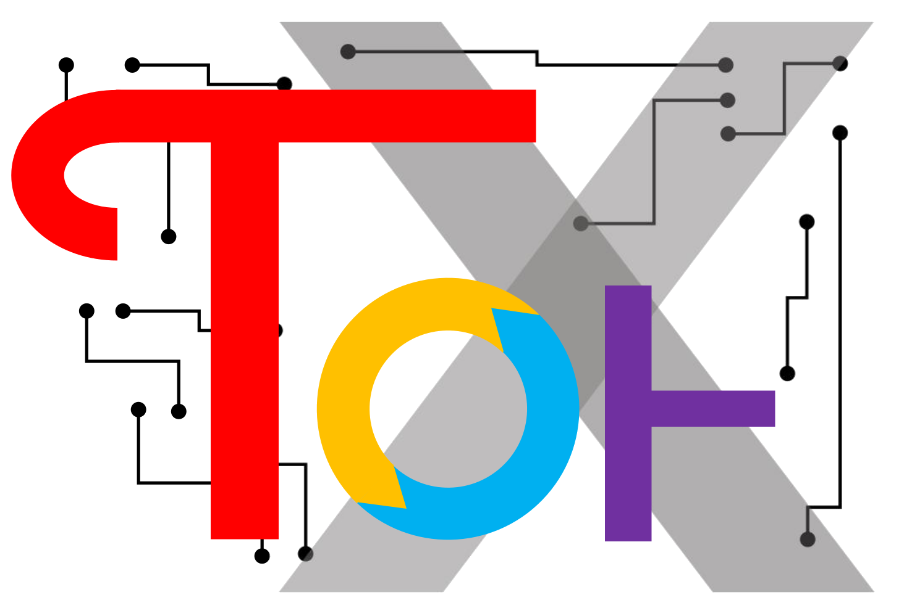

## What's new
    v0.3
    1. Three type of UniTensor can be construct. [symmetry][tagged][untagged] 
    2. The Bond can be tagged with bra/ket or untagged (regular)
    3. Now change the storage of symmetry to blockform. the dense storage for symmetry is deprecated.
    4. Add braketform() to coalesce the bra/ket with row/col(in/out)
    5. rowrank defines the row/col space. 
    6. Enhanced Print_diagram
    7. Seperate Contiguous() and Contiguous\_() for inplace and return type function.
    8. change behavior of GetBlock and PutBlock on a non-symm tensor. in this version, it will return a rank-2 matrix.
    9. Add GetValidQnums() for symmetry tensor
    10. For symmtry, the bond order is relevant. The default fusion tree is in order of ((((0,1),2),3),4 ....
    11. Add UniTensor.dtype() [@property]
    12. Add UniTensor.device() [@property]
    13. nn , some linalg can only accept non-symm, untagged tensor. 

    v0.3.1    
    1. Fix cannot create rank-0 UniTensor bug.

    v0.3.2
    1. Fix Permute() will print the tensor elements bug.

    v0.3.3
    1. Remove the private args in UniTensor.__init__, in place, they are move to private member function __mac() 
    2. Fix UniTensor.__pow__ does not return anything bug. 
    3. Remove unrelated arguments in documentation
    4. Change the order of functions appears in documentation tor10.UniTensor

    v0.3.4
    1. Fix Svd, Svd_truncate, Qr, Qdr crash bug. Originated from the variable change of v0.3.3a 
    2. From 1., iTEBD.py cannot work is fixed. 

    v0.3.5
    1. Fix create Rank-0 Tensor crash bug, also change to real rank-0 tensor
    2. Fix Reshape_() labels are not set bug, and remove redundancy code in the Reshape_()
    3. Add View() and View_, which is the same functionality as pytorch 
    4. Can now create rank-0 tensor from torch.tensor(). 

    v0.3.6
    1. Exchange BRA and KET. KET is now row-space and BRA is now col-space

    v0.3.7
    1. Change `N_rowrank` to `rowrank`
    2. Fix T.Svd_truncate missing argument bug
    3. Fix T.Svd_truncate missing linalg. bug
    4. Fix PutBlock cause mismatch on non-contiguous tensors
    5. Update docs for PutBlock

    v0.3.8
    1. Fix Network trace out all bonds will raise error bug.

    v0.3.9
    1. Change the behaviour of Bonds when initialize a UniTensor. All the bonds will be deepcopy now

    v0.3.10
    1. Change Tor10 -> tor10 for deployment

## Release version
    v0.3.9 alpha

## Known issue
    1. HOSVD is not functional
    2. Contract for UniTensors with symmetry cannot have the bonds in two tensors all are unique labels.

## Requirements
    pytorch>=1.0
    numpy  >=1.15
    sphinx >=1.8.2
    sphinx_rtd_theme >=0.4.2 

## Documentation:

[https://kaihsinwu.gitlab.io/tor10](https://kaihsinwu.gitlab.io/tor10)

## Code naming principle:
    1) the functions start with "_" are the private function that should not be call directly by user.

## Feature:
        
    1. Create Tensor:
        * support multiple precisions.        
        * support devices (cpu and gpu are trivial)
        * preserve the similar api for Bond 
        * can serve as regular generic Tensor or physical tensor (with bra-ket tagged)
        
```python
       ## create a rank-2 Physical Tensor with no symmetry 
       bds = [ Bond(3,BD_BRA), Bond(4,BD_KET)]
       A = UniTensor(bds,label=[2,4],N_inbond=1,dtype=torch.float64,device=torch.device("cpu"))

       ## create a rank-2 generic Tensor 
       bds = [ Bond(4), Bond(6) ]
       B = UniTensor(bds,N_inbond=1)

       ## Moving to GPU:
       A.to(torch.device("cuda:0"))
```

    2. Tensor :
        * vitual swap and permute. All the permute and swap will not change the underlying memory
        * Use Contiguous() or Contiguous_() when needed to actual moving the memory layout.

```python
        A.Contiguous()
```

    3. Multiple Symmetries:
        * Support arbitrary numbers and types of symmetry.
        * Currently support U1 and Zn (with arbitrary n). 

```python
        #> Multiple mix symmetry: U1 x Z2 x Z4
        bd_sym_mix = tor10.Bond(3,qnums=[[-2,0,0],
                                         [-1,1,3],
                                         [ 1,0,2]],
                                 sym_types=[tor10.Symmetry.U1(),
                                            tor10.Symmetry.Zn(2),
                                            tor10.Symmetry.Zn(4)],
                                  tor10.BD_BRA)
``` 
        
    4. Network :
        * See documentation for how to use network.

    5. Autograd mechanism:
        The tor10 now support the autograd functionality. The Contract, Matmul etc will automatically contruct the gradient flow for UniTensor that has [requires_grad=True]
        
        * See documentation for further details


    6. Easy coordinate with pytorch for Neural-Network:
        We provide tor10.nn that can easy cooperate with pytorch.nn.Module to perform neural-network tasks.

```python
        import torch
        import tor10
        class Model(torch.nn.Module):
            def __init__(self):
                super(Model,self).__init__()
                ## Customize and register the parameter.
                self.P1 = tor10.nn.Parameter(tor10.UniTensor(bonds=[tor10.Bond(2),tor10.Bond(2)],rowrank=1))
                self.P2 = tor10.nn.Parameter(tor10.UniTensor(bonds=[tor10.Bond(2),tor10.Bond(2)],rowrank=1))
 
            def forward(self,x):
                y = tor10.Matmul(tor10.Matmul(x,self.P1),self.P2)
                return y

        md = Model()
        print(list(md.parameters()))
        ## Output:
        #    [Parameter containing:
        #    tensor([[0., 0.],
        #            [0., 0.]], dtype=torch.float64, requires_grad=True), Parameter containing:
        #    tensor([[0., 0.],
        #            [0., 0.]], dtype=torch.float64, requires_grad=True)]
```
        * See documentation for further details


    See test.py for further detail application functions.

## Example:

    See iTEBD.py for an simple example of using iTEBD algo. to calculate the 1D-transverse field Ising model 
    See iTEBD_gpu.py for an simple example of the same algo accelerated with GPU. 

    See example.py for elementary usage.

## Developers:

    * Kai-Hsin Wu     kaihsinwu@gmail.com

    * Jing-Jer Yen 
    * Yen-Hsin Wu 
